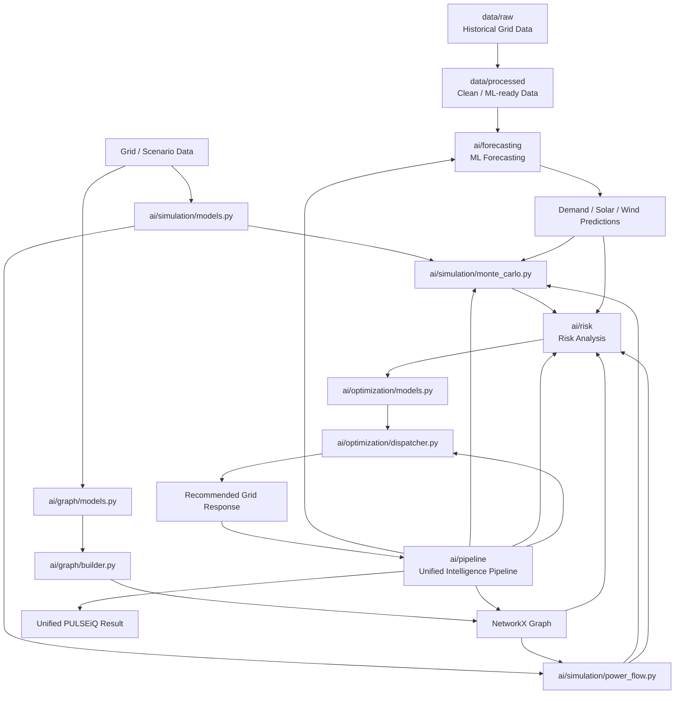

# PULSEiQ — AI-Powered Smart Grid Simulation & Optimization Platform

PULSEiQ is an advanced AI-powered electricity grid simulation, risk analysis, and optimization platform designed for modern, renewable-heavy power systems.

---

##  Core Capabilities

- **AI/ML Forecasting (`ai/forecasting`)**: Multi-horizon load, solar PV, and wind generation forecasting with 10%–90% confidence bands.
- **Power Flow & Monte Carlo Simulation (`ai/simulation`)**: Linear DC power flow calculation, branch line utilization, bus voltage profiles, LOLP (Loss of Load Probability), and EUE (Expected Unserved Energy).
- **Grid Risk & Cascading Failure Engine (`ai/risk`)**: N-1 / N-k contingency screening, thermal overload tripping simulation, component criticality ranking, and standardized grid risk index scorecards.
- **Graph Topology & Network Analytics (`ai/graph`)**: NetworkX-based electrical network representation, graph centrality (betweenness, degree, closeness), bridge detection, cut vertices, and dynamic topology mutations.
- **Optimal Economic Dispatch (`ai/optimization`)**: Constrained economic dispatch with renewable prioritization, battery energy storage (BESS) scheduling, and critical load protection (e.g., hospitals, data centers).
- **End-to-End Grid Pipeline (`ai/pipeline`)**: Automated orchestrator linking forecasting, power flow, risk evaluation, and optimal dispatch into single and multi-step workflows.

---

##  Repository Structure

```
PULSEiQ/
├── ai/
│   ├── forecasting/     # Demand, Solar, and Wind ML Forecasters
│   ├── graph/           # NetworkX topological analyzers & models
│   ├── models/          # Grid data models (Bus, Generator, Line, Battery, etc.)
│   ├── optimization/    # Economic dispatch & BESS optimization solvers
│   ├── pipeline/        # Orchestrator & grid pipeline workflow validators
│   ├── risk/            # N-1 / N-k contingencies & cascading failure analysis
│   └── simulation/      # DC power flow & Monte Carlo probabilistic engine
├── data/
│   ├── raw/             # Raw grid configuration & telemetry data
│   └── processed/       # Cleaned & normalized simulation datasets
├── tests/               # Pytest test suite covering all modules
└── README.md            # Project documentation
```

---

## 🚀 Getting Started

### Prerequisites
- Python 3.10+
- `pip` or virtual environment

### Installation

```bash
# Clone the repository
git clone https://github.com/S-T-HARINI/PULSEiQ.git
cd PULSEiQ

# Create and activate virtual environment
python -m venv venv
# Windows:
.\venv\Scripts\activate
# Linux / macOS:
source venv/bin/activate

# Install dependencies
pip install -r requirements.txt
```

---

##  Running Tests

To run the complete test suite:

```bash
python -m pytest tests/ -v
```

To run a demonstration grid pipeline:

```bash
python -m tests.demo_pipeline
```
## Architecture

The PULSEiQ AI/ML system is organized into independent modules for forecasting, simulation, graph analysis, risk analysis, and optimization.


