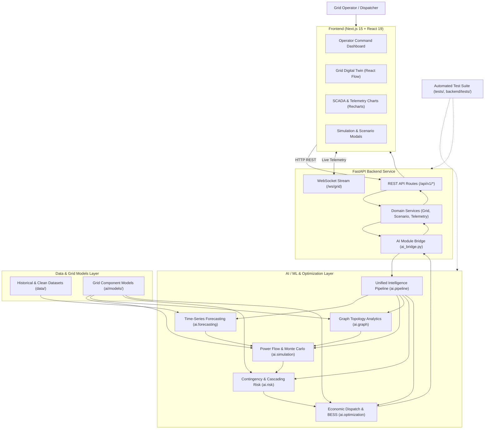

# PULSEiQ — AI-Powered Smart Grid Digital Twin, Simulation & Optimization Platform

PULSEiQ is an integrated power systems intelligence platform designed for modern, renewable-heavy electricity grids. It combines machine learning forecasting, linear DC power flow simulation, NetworkX graph topology analytics, probabilistic contingency risk evaluation, and constrained economic dispatch optimization with a FastAPI backend and a Next.js real-time operator dashboard.

---

## Architecture Overview

PULSEiQ operates across five integrated layers:

1. **Presentation Layer (Frontend)**: Next.js 15 and React 19 interface providing interactive grid topology visualization (React Flow), 24-hour telemetry charts (Recharts), and scenario simulation controls.
2. **Application & API Layer (Backend)**: FastAPI service managing REST endpoints, asynchronous WebSocket telemetry streaming (`/ws/grid`), and Pydantic schema validation.
3. **Bridge & Service Layer**: Backend service registry and dynamic AI bridge (`backend/app/core/ai_bridge.py`) that translates grid state models, executes AI/ML engines, and provides deterministic fallbacks.
4. **Intelligence Layer (AI/ML & Solvers)**: Modular Python engines for time-series forecasting, power flow calculation, graph analytics, cascading failure analysis, and optimal dispatch.
5. **Data & Testing Layer**: Grid topology models, telemetry datasets, and end-to-end automated integration test suites.



---

## Repository Structure

```
PULSEiQ/
├── ai/                          # Reusable AI/ML, simulation, graph, risk & optimization engines
│   ├── forecasting/             # Load, solar PV, and wind power time-series forecasters
│   ├── graph/                   # NetworkX grid topology, centrality, and islanding analyzers
│   ├── models/                  # Pydantic and dataclass grid models (Bus, Generator, Line, BESS, Loads)
│   ├── optimization/            # Constrained economic dispatch and battery scheduling solvers
│   ├── pipeline/                # Unified intelligence orchestrator (GridIntelligencePipeline)
│   ├── risk/                    # N-1 / N-k contingency screening, cascading failures, risk index
│   ├── simulation/              # Linear DC power flow solver and Monte Carlo reliability simulator
│   ├── requirements.txt         # Scientific, ML, graph, and optimization dependencies
│   └── README.md                # AI layer overview and engine specifications
├── backend/                     # FastAPI backend application and real-time streaming services
│   ├── app/
│   │   ├── api/                 # API routers, endpoint definitions, and WebSocket handlers
│   │   ├── core/                # Application configuration and dynamic AI module bridge
│   │   ├── schemas/             # Pydantic request/response validation schemas
│   │   ├── services/            # Domain services (grid, forecast, simulation, risk, optimization, telemetry)
│   │   └── main.py              # FastAPI application entry point, CORS, and lifecycle manager
│   ├── tests/                   # Backend API and integration test suite
│   ├── requirements.txt         # Backend dependencies (FastAPI, Uvicorn, WebSockets, Pydantic)
│   └── README.md                # Backend service documentation and endpoint specifications
├── frontend/                    # Next.js 15 operator interface and visualization application
│   ├── src/
│   │   ├── app/                 # Next.js App Router layout, global styles, and root dashboard page
│   │   ├── components/
│   │   │   ├── dashboard/       # Command metrics, telemetry charts, hero section, module cards
│   │   │   ├── grid/            # React Flow custom nodes, edges, and topology layout
│   │   │   ├── layout/          # Top navigation bar and controls
│   │   │   └── ui/              # Reusable UI primitives (Card, Badge, Button, Icons)
│   │   ├── lib/                 # Grid data structures and mock datasets
│   │   └── types/               # TypeScript interfaces for dashboard, topology, and telemetry
│   ├── package.json             # Frontend dependencies and Next.js scripts
│   └── README.md                # Frontend setup and component overview
├── data/                        # Datasets utilized for forecasting, simulation, and validation
│   ├── raw/                     # Source telemetry, weather profiles, and grid topology records
│   ├── processed/               # Normalized, ML-ready historical demand and generation curves
│   └── README.md                # Data documentation and format descriptions
├── tests/                       # Integrated test suite covering all AI engines and pipelines
│   ├── test_forecasting.py      # Tests for demand, solar, and wind forecasting models
│   ├── test_graph_builder.py    # Tests for NetworkX graph conversion and topology metrics
│   ├── test_grid_models.py      # Tests for grid asset definitions and scenario mutations
│   ├── test_integration.py      # End-to-end integration tests between backend and AI engines
│   ├── test_optimization.py     # Tests for economic dispatch and battery scheduling
│   ├── test_pipeline.py         # Tests for unified pipeline orchestration
│   ├── test_risk.py             # Tests for N-1 contingency, cascade, and risk scorecard
│   ├── test_simulation.py       # Tests for DC power flow and Monte Carlo reliability
│   └── demo_pipeline.py        # Standalone runnable pipeline demonstration
└── README.md                    # Root project documentation
```

---

## Core System Layers

### 1. AI/ML Intelligence (`ai/`)

The `ai/` package provides modular, backend-independent power systems intelligence:

- **Forecasting (`ai/forecasting`)**: Multi-horizon load, solar PV, and wind generation forecasters utilizing XGBoost and Scikit-Learn with probabilistic uncertainty bounds (10% to 90% confidence bands).
- **Power Flow & Simulation (`ai/simulation`)**: High-performance linear DC power flow solver ($B\theta = P$) calculating active line flows, thermal utilization, bus voltage profiles, and frequency deviations ($\Delta f$). Includes Monte Carlo probabilistic simulation for Loss of Load Probability (LOLP) and Expected Unserved Energy (EUE).
- **Graph & Topology (`ai/graph`)**: NetworkX electrical network representation computing degree, betweenness, and closeness centrality, electrical islands, articulation points (cut vertices), bridges, and low-impedance shortest transmission paths.
- **Risk Analysis (`ai/risk`)**: Exhaustive N-1 contingency screening, multi-asset N-k outage evaluation, sequential thermal overload cascading failure modeling, and standardized multi-factor grid risk scoring (`LOW`, `MODERATE`, `HIGH`, `CRITICAL`).
- **Optimization (`ai/optimization`)**: Constrained economic power dispatch solver prioritizing zero-marginal-cost renewables, scheduling Battery Energy Storage Systems (BESS) within State of Charge limits, and enforcing critical load protection (hospitals, trauma centers).
- **Unified Pipeline (`ai/pipeline`)**: `GridIntelligencePipeline` coordinates data validation, forecasting, power flow, graph analysis, and risk scoring into a single unified execution payload.

For detailed documentation, see [ai/README.md](file:///c:/Users/hello/PULSEiQ/ai/README.md).

### 2. FastAPI Backend Service (`backend/`)

The backend layer coordinates API communication, schema validation, and real-time data streaming:

- **Application Entry Point (`backend/app/main.py`)**: Configures CORS, lifecycle background telemetry broadcasting, and route mounting.
- **AI Module Bridge (`backend/app/core/ai_bridge.py`)**: Dynamically discovers and binds the Python AI/ML modules. When AI modules execute, it translates grid representations bi-directionally; if an AI dependency is unavailable, it activates deterministic analytical fallbacks.
- **Domain Services (`backend/app/services/`)**: Encapsulates business logic for grid state management, time-series forecasting, simulation execution, risk analysis, what-if scenario evaluation, and telemetry generation.
- **WebSocket Streaming (`/ws/grid`)**: Emits structured telemetry updates every 2 seconds to connected dashboard clients.

#### Key API Endpoints

| Method | Endpoint | Purpose |
| :--- | :--- | :--- |
| `GET` | `/api/v1/health` | Service health status and AI module connection status summary |
| `GET` | `/api/v1/grid` | Digital Twin grid topology, nodes, lines, and summary metrics |
| `POST` | `/api/v1/forecast` | Time-series load, solar, or wind forecasting with confidence intervals |
| `POST` | `/api/v1/simulation` | Linear DC power flow execution, branch utilization, and voltage profiles |
| `POST` | `/api/v1/risk` | N-1 contingency evaluation, cascading failure risk, and critical load exposure |
| `POST` | `/api/v1/optimization` | Optimal economic dispatch, battery scheduling, and curtailment minimization |
| `POST` | `/api/v1/scenario/what-if` | Multi-stress what-if scenario simulation (Heatwave, Solar Ramp-Down, Wind Storm, N-1 Trip) |
| `WS` | `/ws/grid` | Real-time WebSocket streaming for continuous grid telemetry frames |

For detailed documentation, see [backend/README.md](file:///c:/Users/hello/PULSEiQ/backend/README.md).

### 3. Frontend Operator Interface (`frontend/`)

Built on Next.js 15, React 19, Tailwind CSS, @xyflow/react, and Recharts, the frontend provides an operator-grade control room interface:

- **SCADA Telemetry & System Health**: Displays real-time frequency (Hz), total generation and active load (MW), grid stability index, and active alert counters.
- **Grid Digital Twin (React Flow)**: Interactive topological map visualizing substations, generators, solar/wind farms, battery storage, and transmission line thermal utilization in real time.
- **Telemetry & Generation Charts**: 24-hour time-series charts showing generation vs. load balance, solar and wind contribution, and frequency stability.
- **AI Simulation & Scenario Modals**: Interactive interfaces to trigger N-1 contingency scans, cascading failure simulations, and climate/stress what-if scenarios.

For detailed documentation, see [frontend/README.md](file:///c:/Users/hello/PULSEiQ/frontend/README.md).

### 4. Grid Digital Twin

The Digital Twin provides a software representation of the physical electricity network. It models:

- **Buses & Substations**: Bulk transmission (230kV) and distribution (115kV/69kV) substations with busbar balancing and transformer monitoring.
- **Generation Assets**: Combined-cycle gas turbines, utility-scale solar PV parks, and coastal wind farms with capacity limits, fuel costs, and ramp rates.
- **Energy Storage**: Battery Energy Storage Systems (BESS) tracking State of Charge (SoC %), charge/discharge limits, and MWh capacity.
- **Electrical Loads**: Residential districts, commercial centers, heavy industrial zones, and prioritized critical loads (such as regional hospitals and trauma centers).
- **Transmission Lines**: Branch circuits with impedance parameters ($R + jX$), thermal capacity ratings (MW), active power flows, and utilization percentages.

### 5. Real-Time Telemetry

The platform provides a continuous live telemetry pipeline via WebSockets (`/ws/grid`):

- **Telemetry Message Structure**: Transmits timestamped payloads containing grid status (`NORMAL`, `WARNING`, `CRITICAL`), total generation (MW), total demand (MW), renewable penetration (%), battery SoC (%), grid frequency (Hz), average line utilization (%), and affected component identifiers.
- **Dynamic Synchronization**: Updates frontend state and chart series in real time without requiring manual page refreshes.

---

## System Data Flow

```
[ Grid Operator / Client ]
            │
            ▼ (Interacts via UI / Configures Scenario)
[ Next.js Frontend Dashboard ]
            │
            ▼ (HTTP POST / WebSocket Subscription)
[ FastAPI Backend (API Router) ]
            │
            ▼ (Dispatches to Service Layer)
[ Backend Services (Scenario / Simulation / Risk) ]
            │
            ▼ (Translates Grid State & Invokes AI)
[ AI Module Bridge (ai_bridge.py) ]
            │
            ▼ (Coordinates Execution)
[ GridIntelligencePipeline / AI Submodules ]
   ├── ai.forecasting    --> Predicts load & renewable curves
   ├── ai.simulation     --> Solves DC power flow & line loading
   ├── ai.graph          --> Calculates centrality, bridges & cut vertices
   ├── ai.risk           --> Evaluates N-1 contingencies & cascade propagation
   └── ai.optimization   --> Computes optimal economic dispatch & BESS schedule
            │
            ▼ (Returns Structured Result Dataclass / Schema)
[ Backend AI Bridge & Services ]
            │
            ▼ (Serializes JSON Response / Broadcasts Telemetry Frame)
[ Next.js Frontend Dashboard ]
            │
            ▼ (Renders Topology Nodes, Warning Badges, Dispatch Actions & Charts)
[ Grid Operator View ]
```

---

## Example: Heatwave + Transmission Line Failure

To illustrate how the entire PULSEiQ system functions together, consider a compound grid stress scenario: an extreme summer heatwave coinciding with a major transmission line forced outage.

1. **Scenario Configuration**: The operator selects the "Extreme Heatwave" scenario with an N-1 line trip on the primary corridor (`line-north-central-1`) in the frontend.
2. **API Request**: The frontend sends a `POST` request to `/api/v1/scenario/what-if` with a demand multiplier of 1.25x and the specified failed line ID.
3. **Bridge Translation**: The backend `ScenarioService` receives the request and utilizes `AIModuleBridge` to convert the current grid state into an `ElectricityGrid` domain model with updated load and line status.
4. **Demand & Renewable Forecasting**: `ai.forecasting` projects a 25% spike in cooling demand during peak afternoon hours alongside high solar PV output.
5. **Power Flow Simulation**: `ai.simulation` executes a DC power flow calculation on the modified topology. With `line-north-central-1` tripped, power flow redistributes across parallel circuits, driving the secondary corridor (`line-central-south-1`) to 94% thermal utilization.
6. **Graph Topology Analysis**: `ai.graph` detects that the outage increases betweenness centrality on the central substation and identifies remaining paths connecting generation to the critical hospital load.
7. **Risk Assessment**: `ai.risk` evaluates the network state, flags the elevated line loading, and raises the Grid Risk Index from `0.14` (`LOW`) to `0.58` (`HIGH`). It notes that the hospital feeder remains energized but is now operating under a single-contingency alert.
8. **Optimal Dispatch Solution**: `ai.optimization` calculates an optimal response: it schedules the BESS battery to discharge at 20 MW, ramps the combined-cycle gas turbine to cover the net deficit, and avoids shedding any critical hospital load.
9. **Backend Response**: The backend packages the results into a validated `ScenarioWhatIfResponse` JSON payload.
10. **Frontend Visualization**: The dashboard updates the topology map (highlighting the tripped line in red and the strained corridor in amber), displays the revised 24-hour demand curve, and surfaces the recommended dispatch actions to the operator.

---

## Technology Stack

| Layer | Technologies | Purpose |
| :--- | :--- | :--- |
| **Frontend UI** | Next.js 15, React 19, TypeScript | Server-rendered and client-side operator dashboard |
| **Styling & Layout** | Tailwind CSS, Lucide React | Modern dark-mode interface and responsive control panels |
| **Topology Visualization** | @xyflow/react (React Flow) | Node-edge graph rendering for the Grid Digital Twin |
| **Data Visualization** | Recharts | Time-series SCADA charts and generation mix curves |
| **Backend API** | FastAPI, Uvicorn, Python 3.10+ | High-performance asynchronous REST and WebSocket server |
| **Data Validation** | Pydantic v2, Pydantic Settings | Strict request, response, and environment schema validation |
| **Machine Learning** | Scikit-learn, XGBoost, PyTorch | Multi-horizon load and renewable generation forecasting |
| **Power Flow & Simulation** | NumPy, SciPy | Linear DC power flow equations and Monte Carlo trials |
| **Graph Analytics** | NetworkX | Topological centrality, bridge detection, and cut vertices |
| **Mathematical Optimization** | SciPy Linear Programming, PuLP, OR-Tools | Constrained economic dispatch and BESS scheduling |
| **Testing** | Pytest, Pytest-Asyncio, HTTPX | Unit, integration, and API contract test automation |
| **Real-Time Streaming** | WebSockets | Live SCADA telemetry broadcasting (`/ws/grid`) |

---

## Getting Started

### Prerequisites

- **Python**: Version 3.10 or higher
- **Node.js**: Version 18.18 or higher (Node 20+ recommended)
- **Package Managers**: `pip` (Python) and `npm` (Node.js)

---

### Installation

#### 1. Backend & AI Environment Setup

From the repository root:

```bash
# Create and activate a Python virtual environment
python -m venv venv

# On Windows:
.\venv\Scripts\activate

# On Linux / macOS:
source venv/bin/activate

# Install AI/ML, simulation, graph, and optimization dependencies
pip install -r ai/requirements.txt

# Install FastAPI backend dependencies
pip install -r backend/requirements.txt
```

Configure backend environment variables:

```bash
# On Linux / macOS:
cp backend/.env.example backend/.env

# On Windows (PowerShell):
Copy-Item backend\.env.example backend\.env
```

#### 2. Frontend Setup

From the repository root:

```bash
cd frontend
npm install
cd ..
```

---

## Running the Application

Running the complete integrated platform requires starting both the FastAPI backend and the Next.js frontend in separate terminals.

### Terminal 1: Start the FastAPI Backend

From the repository root with your virtual environment activated:

```bash
python -m uvicorn backend.app.main:app --reload --host 0.0.0.0 --port 8000
```

- **REST API Base URL**: `http://localhost:8000`
- **Interactive Swagger Documentation**: `http://localhost:8000/docs`
- **ReDoc Documentation**: `http://localhost:8000/redoc`
- **WebSocket Telemetry Stream**: `ws://localhost:8000/ws/grid`

### Terminal 2: Start the Next.js Frontend

From the repository root:

```bash
cd frontend
npm run dev
```

- **Operator Dashboard**: `http://localhost:3000`

The frontend communicates with the backend REST endpoints at `http://localhost:8000/api/v1` and connects to the WebSocket stream at `ws://localhost:8000/ws/grid`.

---

## Testing & Quality Assurance

PULSEiQ includes comprehensive test suites covering individual AI engines, mathematical solvers, backend REST endpoints, WebSocket lifecycle handlers, and end-to-end integration flows.

### Running the Full AI and Integration Test Suite

From the repository root:

```bash
python -m pytest tests/ -v
```

### Running Backend API & Contract Tests

```bash
python -m pytest backend/tests/ -v
```

### Running the Standalone Pipeline Demo

To verify end-to-end execution of the unified pipeline without starting web servers:

```bash
python -m tests.demo_pipeline
```

---

## Git Branch Context

- **`integration`**: The primary branch containing the fully integrated AI/ML intelligence, FastAPI backend, Next.js frontend, data layer, and automated tests.
- Feature and component branches serve as development workspaces and are merged into `integration` for full-system operation.

---

## Detailed Documentation

For in-depth implementation details, mathematical formulations, and component specifications, refer to the individual module documentation:

- **AI/ML Layer Overview**: [ai/README.md](file:///c:/Users/hello/PULSEiQ/ai/README.md)
- **Forecasting Module**: [ai/forecasting/README.md](file:///c:/Users/hello/PULSEiQ/ai/forecasting/README.md)
- **Power Flow & Simulation Engine**: [ai/simulation/README.md](file:///c:/Users/hello/PULSEiQ/ai/simulation/README.md)
- **Grid Risk & Contingency Engine**: [ai/risk/README.md](file:///c:/Users/hello/PULSEiQ/ai/risk/README.md)
- **Graph Topology & Network Analytics**: [ai/graph/README.md](file:///c:/Users/hello/PULSEiQ/ai/graph/README.md)
- **Economic Dispatch & Optimization**: [ai/optimization/README.md](file:///c:/Users/hello/PULSEiQ/ai/optimization/README.md)
- **Unified Intelligence Pipeline**: [ai/pipeline/README.md](file:///c:/Users/hello/PULSEiQ/ai/pipeline/README.md)
- **Backend Service & API**: [backend/README.md](file:///c:/Users/hello/PULSEiQ/backend/README.md)
- **Frontend Dashboard**: [frontend/README.md](file:///c:/Users/hello/PULSEiQ/frontend/README.md)
- **Data Architecture**: [data/README.md](file:///c:/Users/hello/PULSEiQ/data/README.md)